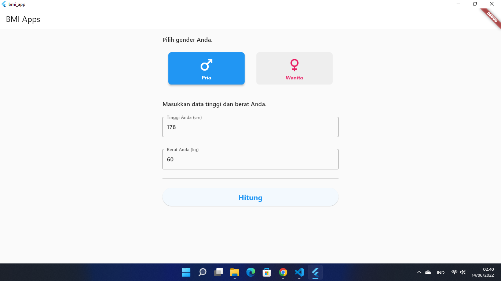
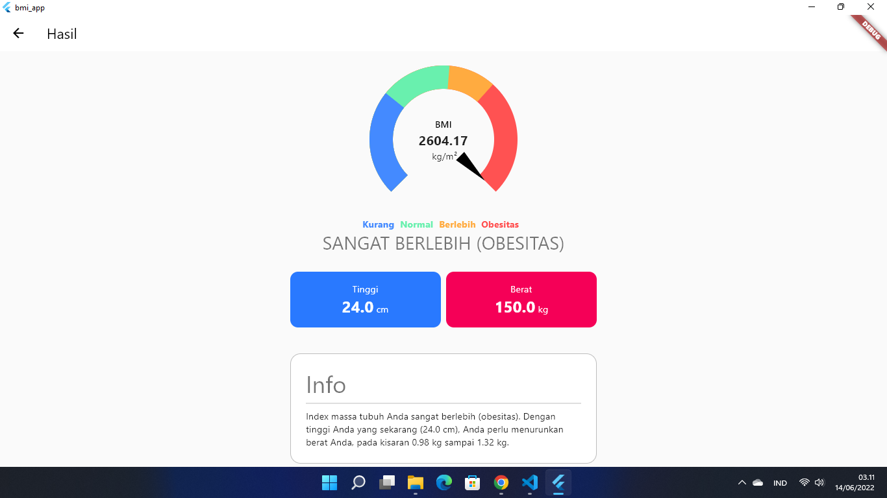

# BMI app

## Sekilas

Ini adalah aplikasi perhitungan index massa tubuh (BMI / *Body mass index*)
yang dimaksudkan untuk melengkapi tugas proyek akhir pada kelas
[Belajar Membuat Aplikasi Flutter untuk pemula](https://www.dicoding.com/academies/159).

## Feature

1. Pengguna dapat memasukkan data tinggi, berat dan jenis kelamin (gender).
2. Pengguna dapat mengetahui nilai BMI-nya berdasarkan data yang diinput.
3. Pengguna dapat memperoleh informasi tambahan mengenai status berat pengguna
   dan berapa nilai berat yang ideal untuknya.

## Screenshot

